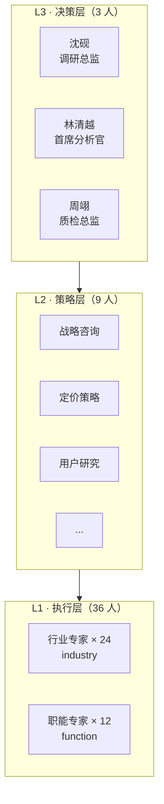

# Agent 角色与协议 · Agents

本文档描述VeriDeep 的多 Agent 体系：专家分层、角色职责、消息协议与四条铁律。

---

## 1. 设计理念

VeriDeep 把竞品调研建模为一支**虚拟咨询团队**的协作过程。系统内置 48 位虚拟专家（定义见 [experts.json](../backend/app/data/experts.json)），按职级分为三层。每次调研由编排引擎根据需求**自动组队**：决策层拆解与终审，策略层与执行层负责具体分析与采集。

> 注：这里的「专家」是带有领域知识画像（`knowledge_base` / `knowledge_tags`）的角色设定，用于驱动 LLM 以对应专业视角生成论点与分析，并体现在工作台、专家页与报告署名中。

---

## 2. 专家分层



| 层级 | 人数 | 分组 | 职责 |
|---|---|---|---|
| **L3 决策层** | 3 | decision | 统筹全局、终审签发、质检裁决 |
| **L2 策略层** | 9 | strategy | 战略 / 定价 / 用户研究等策略级分析 |
| **L1 执行层** | 36 | industry(24) + function(12) | 行业与职能维度的具体采集与分析 |

### L3 决策层（核心三人组）

| ID | 角色 | 一句话职责 |
|---|---|---|
| L3-001 沈砚 | 调研总监 / Chief Research Director | 拆解需求、组建专家队、终审并签发报告 |
| L3-002 林清越 | 首席分析官 / Chief Analyst Officer | 把控分析质量与逻辑严谨性，裁定结论是否成立 |
| L3-003 周翊 | 质检总监 / Chief Quality Officer | 扮演魔鬼代言人，主导事实校验与返工闭环 |

每位专家含字段：`id` `level` `group` `name` `role_title` `one_liner` `skills` `knowledge_base` `knowledge_tags` `avatar` 等。

---

## 3. 角色到流水线的映射

| 流水线节点 | 主导层级 | 说明 |
|---|---|---|
| intake / orchestrator | L3 决策层 | 总监拆解需求、组队、排计划 |
| collect | L1 执行层 | 行业/职能专家按角度采集证据 |
| analyze | L2 + L1 | 策略与执行层基于证据产出论点与结构化对象 |
| write | L2 + L1 | 各章由对应专业视角撰写 |
| audit | L3 质检总监 | 事实校验、覆盖度评估、决定是否返工 |
| done | L3 调研总监 | 终审签发 |

---

## 4. 消息协议（Envelope）

Agent 间通过结构化信封 `Envelope`（[models.py](../backend/app/core/models.py)）传递任务，避免自由文本带来的歧义：

```python
@dataclass
class Envelope:
    msg_id: str
    sender: str       # 发送方 agent_id
    receiver: str     # 接收方 agent_id
    task_type: str    # PRODUCE（生产）| REWORK（返工）| PASS（通过）
    payload: dict     # 任务载荷
    issues: list      # 质检发现的问题（Issue 列表）
    trace_ref: str    # 关联的 Trace span
```

质检发现的问题用 `Issue` 描述：

```python
@dataclass
class Issue:
    issue_id: str
    target: str       # 指向 claim_id 或 section
    severity: str     # high | medium | low
    reason: str       # 问题原因
    raised_by: str    # 提出方 agent_id
```

返工闭环：质检（audit）发现证据不足 → 发 `REWORK` 信封打回 collect 补采；维度缺失 → 打回 analyze 重分析。每轮返工后重算质量指标，记录 `issues_resolved` 与前后 metrics delta。

---

## 5. 证据与论点

### Evidence（证据）

每条采集到的证据都带可信度与时效（见 [credibility.py](../backend/app/core/credibility.py)）：

```
evidence_id · source_url · source_type · title · excerpt · captured_at
credibility(0-100) · collected_by · brand · domain · freshness_days
```

`source_type` 覆盖：`official` `news` `financial_report` `zhihu` `bilibili` `weibo` `xiaohongshu` `douyin` `review`。

### Claim（论点）

每个论点必须挂证据，置信度由 `make_claim` 按规则计算：

| 条件 | 置信度 |
|---|---|
| 无任何证据 | `unverified` |
| ≥ 2 个独立域名交叉验证 | `high` |
| ≥ 2 条证据（同源） | `medium` |
| 仅 1 条证据 | `low` |

---

## 6. 四条铁律

整个 Agent 体系遵循四条不可违背的原则：

1. **无证据不立论**：任何结论必须挂接证据 ID，否则标记 `unverified`，绝不编造。
2. **交叉验证**：关键论点要求 ≥ 2 个独立域名佐证才可判为高置信。
3. **返工闭环**：质检不达标必须打回补采或重分析，而非降低标准放行。
4. **可观测**：每个 Agent 的 Prompt、输入输出、Token、决策、引用证据全部落 Trace，可查可回放。

> 这四条铁律是「让每个结论都有出处」这一产品理念的工程化落地。
