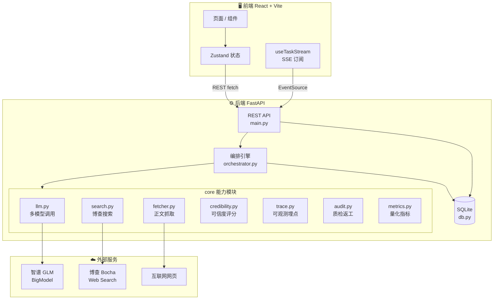
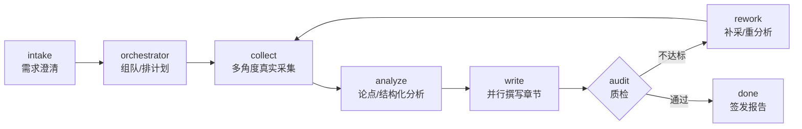

# 系统架构 · Architecture

本文档描述VeriDeep 的整体架构、模块划分、Deep Research 流水线与关键数据流。

---

## 1. 总览

VeriDeep 是一个前后端分离的多 Agent 竞品情报系统：

- **前端**（`frontend/`）：React 19 + Vite 单页应用，通过 REST + SSE 与后端通信。
- **后端**（`backend/`）：FastAPI 应用，内含多 Agent 编排引擎、真实联网采集、LLM 调用、可信度评分、可观测 Trace 与 SQLite 持久化。
- **部署镜像**（`api/`）：后端代码的 Vercel Serverless 镜像，仅用于云端部署（见 [DEPLOYMENT.md](./DEPLOYMENT.md)）。



---

## 2. Deep Research 流水线

一次完整调研由编排引擎（[orchestrator.py](../backend/app/core/orchestrator.py)）驱动，节点如下：



| 节点 | 职责 | 关键模块 |
|---|---|---|
| **intake** | 解析用户 query，生成 4–6 个澄清问题 | `orchestrator._clarify_questions` |
| **orchestrator** | 拆解需求、组建专家队、制定调研计划与搜索角度 | `orchestrator` + `experts.json` |
| **collect** | 每个竞品多角度多轮真实搜索 + 正文抓取 + 乱码/相关性过滤 + 可信度评分 | `search.py` `fetcher.py` `textquality.py` `credibility.py` |
| **analyze** | 基于证据生成论点（Claim）、舆情、三类结构化对象（功能树/定价/画像） | `orchestrator._analyze` `schemas.py` `sentiment.py` |
| **write** | 9–12 章并行撰写（`asyncio.gather`），逐章实时进度，核心章/辅助章用不同模型 | `orchestrator._write_sections` |
| **audit** | 质量评估（覆盖度/置信比/schema 完整度），不达标则打回补采或重分析 | `audit.py` |
| **done** | 汇总报告、metrics、trace，落库并通过 SSE 下发 | `db.py` `metrics.py` |

### 三档调研模式

由 `MODE_CONFIG` 控制差异（搜索角度数 / 每角度抓取数 / 章节集 / 模型档位 / freshness / 写作深度）：

| 模式 | 搜索角度 | 每竞品抓取 | 章节数 | 模型 | 返工轮数 |
|---|---|---|---|---|---|
| 快速 quick | 4 | 6 | 5 章 | 全 glm-5.1 | 0 |
| 深度 deep | 6 | 12 | 9 章 | 5.2 核心 + 5.1 辅助 | 1 |
| 专家级 expert | 9 | 16 | 12 章（含创新章） | 5.2 核心 + 5.1 辅助 | 2 |

---

## 3. 多模型编排

LLM 调用统一经 [llm.py](../backend/app/core/llm.py)，按任务类型分配模型以充分利用各模型并发额度：

| 档位 | 默认模型 | 用途 | 并发 |
|---|---|---|---|
| core | `glm-5.2` | 核心章（摘要/功能/定价/结论/创新章） | 10 |
| aux | `glm-5.1` | 辅助章（格局/画像/趋势/SWOT/风险） | 10 |
| fast | `glm-z1-air` | 杂务（intake/澄清/情感分类/单条重写） | 30 |

写作阶段 9–12 章通过 `asyncio.gather` 并行，单章独立 token 预算与模型，失败不影响其他章节。

---

## 4. 实时通信：SSE 思维流

工作台通过 `GET /api/tasks/{task_id}/stream`（Server-Sent Events）实时接收流水线事件：

| 事件类型 | 含义 |
|---|---|
| `node_update` | 流水线节点状态变更 |
| `thought` | Agent 思考/发现 |
| `message` | 结构化消息（含返工 rework） |
| `evidence` | 新采集证据 |
| `chart` / `image` | 图表 / 图片产出 |
| `progress` | 进度（百分比、证据数、token 用量） |
| `trace` | 可观测 Trace span |
| `report_ready` / `done` / `error` | 报告就绪 / 完成 / 错误 |

前端 [useTaskStream.ts](../frontend/src/hooks/useTaskStream.ts) 订阅这些事件并更新 Zustand store。

---

## 5. 可观测性 Trace

每次 LLM 调用都会在 [trace.py](../backend/app/core/trace.py) 记录一条 `TraceSpan`：

```
span_id · task_id · seq · agent_id · stage · purpose · model
prompt(摘要) · response(摘要) · prompt_tokens · completion_tokens · total_tokens
latency_ms · decision · evidence_ids · ts
```

借助 Python 3.9 `asyncio.to_thread` 复制 contextvars 的特性，实现**无侵入埋点**（无需给每个 `chat()` 改签名）。Trace 落 SQLite `traces` 表，并：

- 在工作台悬浮面板实时滚动；
- 在报告页「决策回放」按 `seq` 步进高亮对应 Agent 与引用证据；
- 在独立 `/trace/:reportId` 页签查询每个 Agent 的 Prompt/输出/Token/决策。

---

## 6. 数据持久化

SQLite（[db.py](../backend/app/core/db.py)）主要表：

| 表 | 内容 |
|---|---|
| `tasks` | 任务、澄清答案、模式 |
| `reports` | 报告全文 JSON（含 sections/trace/metrics/structured/data_grid） |
| `evidences` | 全局证据溯源库（含可信度、时效、来源） |
| `traces` | 可观测决策链路 |
| `subscriptions` | 竞品监控订阅 |
| `report_feedback` | 人工修正反馈（→ 业务闭环指标） |

报告整份 JSON 存于 `reports.data` 并随 `GET /api/reports/:id` 一次下发，前端零额外请求即可渲染 trace / metrics / 结构化对象。

---

## 7. 前端结构

```
src/
├── pages/        # 首页 / 澄清 / 工作台 / 报告 / 图谱 / Trace / 专家 / 知识库 / 仪表盘 / 调研库
├── components/   # VTracePanel / VDecisionReplay / VDataGrid / VChart / VClaimCard / VEvidenceFeed …
├── layout/       # AppLayout（带侧边栏）/ VSidebar
├── store/        # taskStore / reportStore / expertStore / annotationStore / uiStore（Zustand）
├── hooks/        # useTaskStream（SSE）
├── lib/          # api.ts（REST + SSE 封装）
└── types.ts      # 全量契约类型
```

路由见 [App.tsx](../frontend/src/App.tsx)：带侧边栏的常规页（首页/调研库/知识库/专家/仪表盘）与全屏沉浸页（澄清/工作台/报告/图谱/Trace）。
